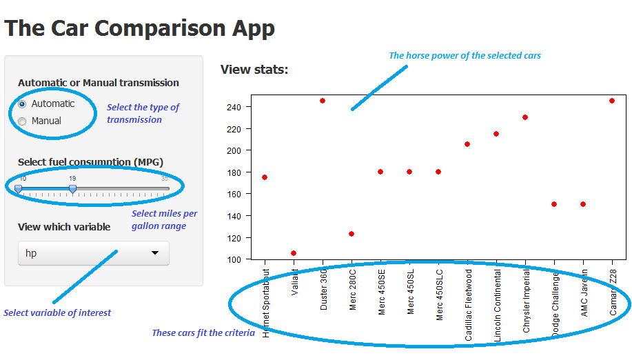
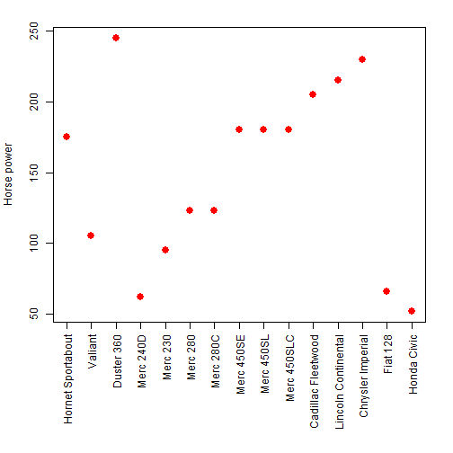

---
title       : The Car Comparison App
subtitle    : See stats of the cars you care about
author      : This presentation is made by Wai-Wah Liu
job         : Use arrow keys or arrow buttons to go through slides
framework   : io2012        # {io2012, html5slides, shower, dzslides, ...}
highlighter : highlight.js  # {highlight.js, prettify, highlight}
hitheme     : tomorrow      # 
widgets     : []            # {mathjax, quiz, bootstrap}
mode        : selfcontained # {standalone, draft}
knit        : slidify::knit2slides

--- 

## Have you had enough of....

1. Not knowing the key statistics of the car you want to buy?
2. Being unclear how different cars compare to eachother?
3. Pushy and dodgy car sales men?
4. ... or maybe you love cars and want to view and compare stats

### ....then The Car Comparison App is the app for you!!

--- .class #id

## Here's how it works



--- 
## The App uses the "mtcars" dataset
 

--- 
## Notes

The previous plot was made with the following embedded code:

```r
data(mtcars)
par(mar=c(10,4,2,2)+0.1)
plot(mtcars[5:19 ,4], xaxt="n", xlab="", ylab="Horse power", col="red", pch=19, cex=1.5)
axis(labels=row.names(mtcars)[5:19], at=1:length(5:19), las=2, side=1)
```
The following variables are available to examine:
  - Amount of cylinders  - Displacement
  - Horse power          - Rear axle ratio
  - Weight               - Quarter mile time
  - Number of gears      - Number of carburetors
